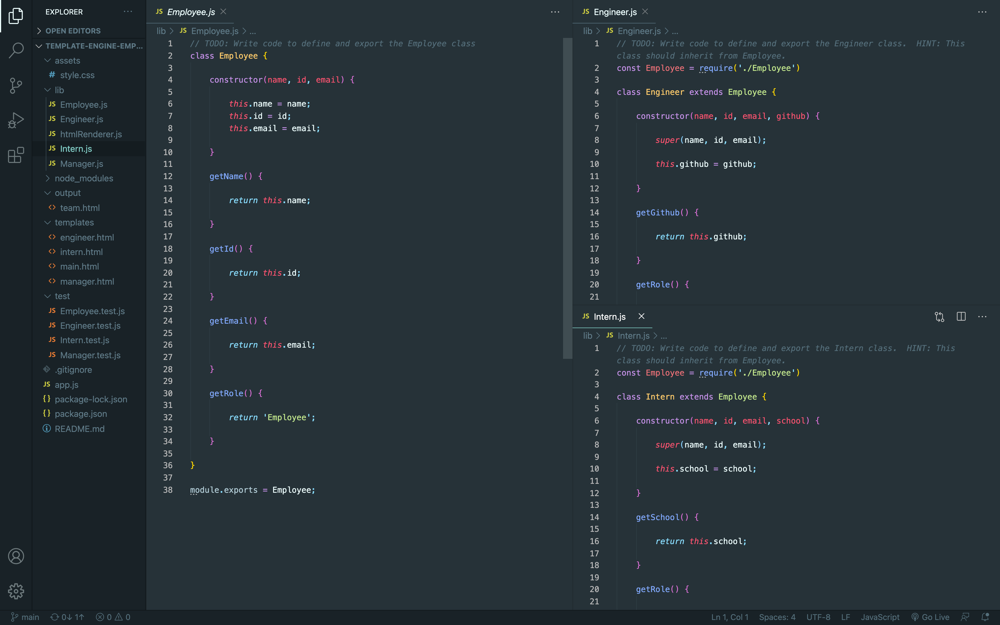

# Template Engine Employee Summary

## Description

The purpose of this project is to create a command line application that will allow the user to generate a webpage based on the information they enter in about their team members. This information that's entered in will depend on their job role and specific information pertaining to that role.

## Table of Contents

* [Links](#links)

* [Usage](#usage)

* [Learning Outcomes](#learning-outcomes)

* [Conclusion](#conclusion)

## Links

* [GitHub Repo](https://github.com/elizabethbrandt/Template-Engine-Employee-Summary)

* [Watch the demo on YouTube](https://youtu.be/OkbVPX1JX4I)

## Usage

* This application is used through the terminal using the npm package "Inquirer". It asks the user certain questions that vary depending on the job role of the employee and then that information is pushed into an HTML template page designated for that role. Once all the questions are answered and all the team members are input in to the terminal, all those templates are rendered into a single HTML file that displays all employees' information into individual cards. 

Below is a screenshot that displays how each class of employee (`engineer`, `intern`, and `manager`) is extended from the main contructor of `employee`.

Next is a screnshot of the functioning code that displays the questions that are in the js file for the inquirer, the functioning inquirer in the terminal, and then the HTML that's generated from answering the questions.

## Learning Outcomes

#### Using Unit Testing

* Though I don't completely understand how to build the unit tests, this helped me know exactly how to build my classes. They were also very handy in making sure that I built the classes correctly before I moved further

#### Using Classes

* We were able to tie in the information that ties to all employees (name, id, and phone number) while building out information that directly pertained to that specific class of employee. For the Engineer it asked for GitHub name, for Intern it asked for the school, and for Manager it asked for the office number.

#### Using "when" for Inquirer

* Being able to use the "when" property made it incredibly easy to be able to ask conditional questions based on the user's answers. I struggled to use it properly at first - my syntax was slightly off - so I abandoned the use of it at first and went down a different path. However, I came back to it again and was able to keep my code more DRY and deleted several lines of code just by getting that syntax correct. 

## Conclusion

In conclusion, I actually really enjoyed doing this assignment! Though there were pieces of the pre-built code I couldn't have done myself, like the unit tests and the htmlrenderer.js files, I was able to understand how all of the pieces came together. 
